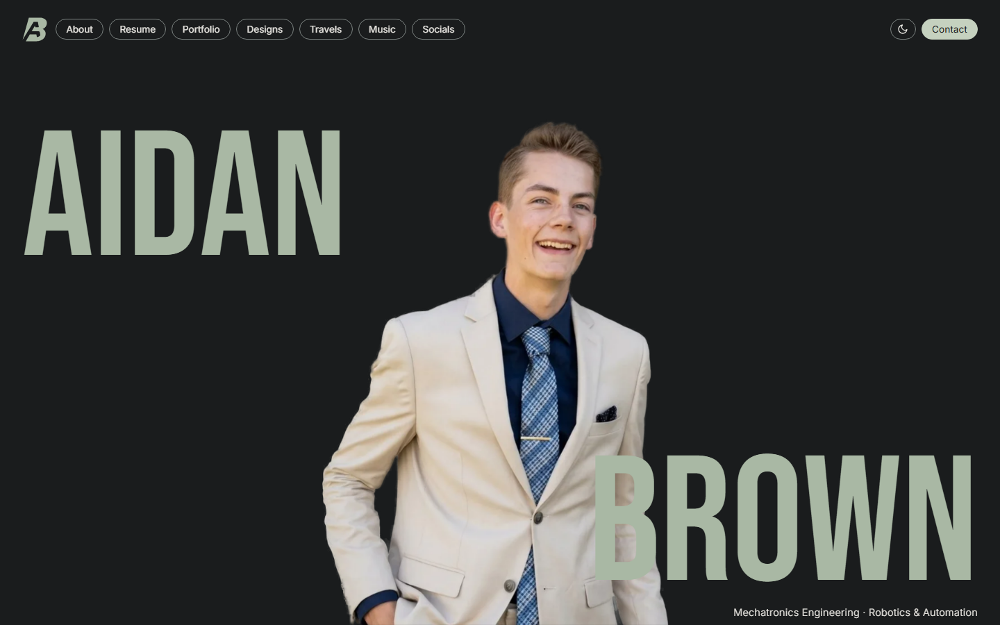
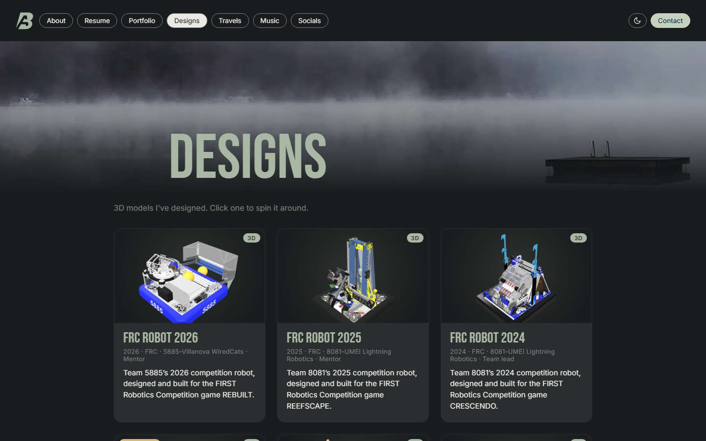
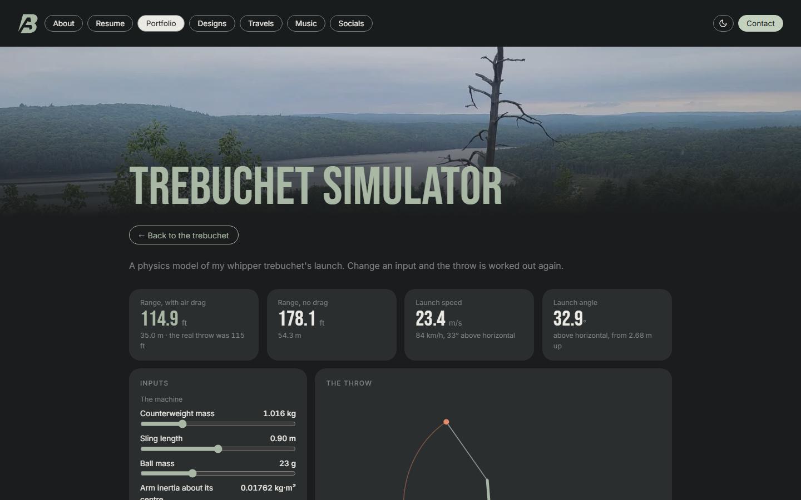
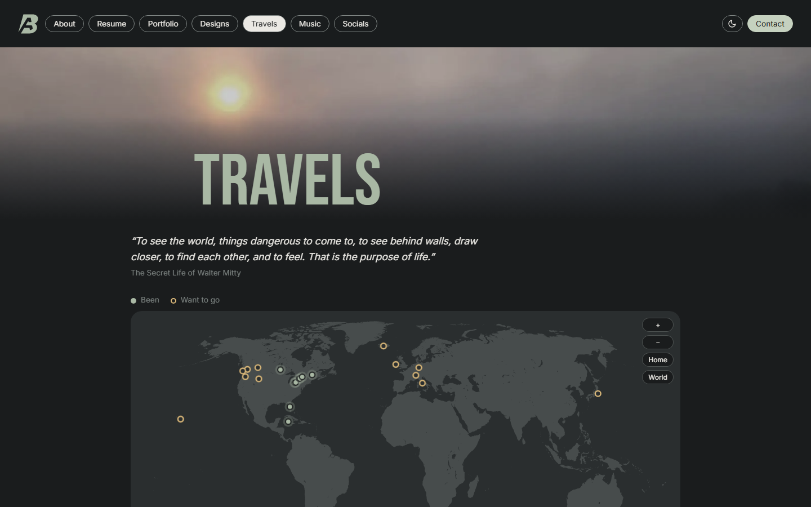

# aidanwbrown.com

The source code of my personal website, **[aidanwbrown.com](https://aidanwbrown.com)**. It holds my engineering portfolio, CAD models you can spin around in the browser, my resume, and a few personal pages.

I'm Aidan Brown, a Mechatronics Engineering student at the University of Windsor. I built the site from scratch in plain HTML, CSS and JavaScript, with no website builder or framework, to show my work properly and to learn web development along the way.

## What's in it

| | |
|---|---|
| **Portfolio** (`portfolio.html`, `project.html`, `js/projects.js`) | Every project is one entry in `js/projects.js`. The cards, the project pages, the photo galleries and the "Documents & code" lists are all generated from it and from the folders of files next to it, so adding a project never needs new HTML. |
| **3D design viewer** (`designs.html`, `js/designs.js`) | Built on three.js. Models are exported from Autodesk Inventor as glTF and compressed at build time. It has an orbit view, configuration toggles where parts glide between poses (stowed / deployed), an exploded view, a ¾ section cut with filled cut faces, and card pictures rendered in the browser when no image exists. |
| **Trebuchet simulator** (`trebuchet-sim.html`, `js/trebuchet-physics.js`) | Simulates a whipper trebuchet launch in the browser: the equations of motion for the arm, counterweight and sling, then the flight, the energy losses and an animation. It's a port of the C++ model from my university trebuchet project. |
| **Travels map** (`travels.html`, `js/travels.js`) | A world map drawn with D3 from Natural Earth data, with a pin for each place. Hovering a pin shows a card, and clicking one opens that place's gallery. |
| **Resume and About** (`js/docx-page.js`) | Generated from Word documents with Mammoth, so updating a page only means editing the .docx. On deploy they're converted to HTML ahead of time, so visitors don't download the converter. |
| **Contact form** (`worker/index.js`) | A Cloudflare Worker checks Cloudflare Turnstile, and a honeypot catches bots. The message is then emailed with Cloudflare Email Routing. |

## How it runs

- **Hosting:** Cloudflare Workers with static assets (`wrangler.jsonc`). Most requests are plain files. The Worker script only runs for `/api/*` (the contact form) and `/cad/*` (the STEP downloads).
- **CAD downloads** are stored in an R2 bucket instead of git, so there's no 25 MB file limit. `scripts/sync-cad.mjs` uploads new or changed files.
- **Build step** (`scripts/list-banners.mjs`, `scripts/small-copies.mjs`) runs on every deploy:
  - It checks the hand-edited project lists for typos, so a missing comma can't blank a page.
  - It writes the JSON file lists the pages read.
  - It makes small WebP copies of photos, gzipped models and pre-converted Word pages.
- **Caching** rules are in `_headers`. Content files are rechecked every visit, and vendor files and fonts are cached forever under fixed names.
- **Deploys** happen automatically on every push to the main branch.

## About this repository

- **This is a public copy.** I work in a private repo, and a GitHub Action copies an approved list of files into this one on every push (`scripts/publish-public.mjs`, `.github/publish-public.yml`). Before anything is copied, a privacy check scans it, so personal details can't end up here by accident.
- **Photos, 3D models, CAD files, reports and the Word documents are not included.** Some of them show other people or belong to my robotics teams. A clone of this repo shows the page layouts, but without the content. To see the full site, visit [aidanwbrown.com](https://aidanwbrown.com).
- **The contact address** in `worker/index.js` and `wrangler.jsonc` is a placeholder.
- **Built with an AI assistant.** I wrote the simpler pages myself to learn, and worked with an AI coding assistant (Claude Code and Claude Cloud) on the more complex parts, such as the 3D viewer and the build scripts. Some code comments are notes to myself or to the assistant ("ask Claude to…"), and I've left them as they are.

## Licence

Copyright © 2026 Aidan Brown. All rights reserved. You're welcome to read the code. Please don't copy or reuse it without asking, see [LICENSE](LICENSE). The libraries in `js/vendor/` (three.js, D3, topojson-client, Mammoth) keep their own open-source licences.

Contact: [contact@aidanwbrown.com](mailto:contact@aidanwbrown.com)
